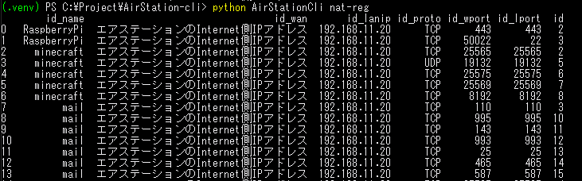
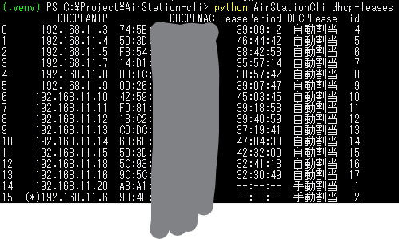

# AirStation-Cli(Beta)

## Usage-Cli
### Description

```shell
# Python
python AirStationCli.py [OPTIONS] [ACTION]
```

### Login

```shell
python AirStationCli.py login --default-gateway 192.168.11.1 -u admin -p password
# ログインに成功しました。 or パスワードが間違っています。etc.
```
| argument          | alias    | default      | description       |
|-------------------|----------|--------------|-------------------|
| --default-gateway |          | 192.168.11.1 |                   |
| --username        | -u -user | admin        |                   |
| --password        | -p -pass | password     |                   |
| --login-mode      |          | auto         | auto, force, skip |
| --mobile          |          | false        |                   |
| --format          | -f       | table        | json, csv         |
| --output          | -o       | None         | file path         |
| --json-indent     |          | None         | int               |

### GetName

```shell
python AirStationCli.py name
# WSR-1166DHPL2 - BUFFALO AirStation
```

### NatRegulation

```shell
python AirStationCli.py nat-reg
# table
```


### DhcpLeases

```shell
python AirStationCli.py dhcp-leases
# table
```


## Usage-API

### AirStationCli.AirStationCli

```python
from AirStationCli import AirStationCli
airstation = AirStationCli.AirStationCli(default_gateway="192.168.11.1")
```

| argument        | default      |
|-----------------|--------------|
| default_gateway | 192.168.11.1 |

### Login

```python
airstation.login_get().login_post(username="admin", password="password", mobile=False)
print(airstation.get_red_info())
# False or パスワードが間違っています。etc.
```

| argument        | default      |
|-----------------|--------------|
| username        | admin        |
| password        | password     |
| mobile          | false        |


### GetName

```python
print(airstation.index_adv().get_title())
# WSR-1166DHPL2 - BUFFALO AirStation
```

### Init

```python
airstation.init()
```

Attributes
- AirStationCli: object
Methods
- downloadcfg(): str
- uploadcfg(cfgfile): str
- reboot(): bool

Note: `uploadcfg()` NotWorking

### NatRegulation

```python
airstation.nat_reg()
```

Attributes
- AirStationCli: object
- data: List[AirStationCliNatData Object]

Methods
- add(group, lanip, wan="wan", nosave_proto="tcp/udp", porttype="tcp", wanport=80, lanport=80, ip="1.1.1.1"): bool

#### method add()

| argument     | default    | type                     | condition                                                                     |
|--------------|------------|--------------------------|-------------------------------------------------------------------------------|
| group        | (required) | str                      |                                                                               |
| lanip        | (required) | str                      |                                                                               |
| wan          | wan        | wan, manual              |                                                                               |
| nosave_proto | tcp/udp    | all, icmp, one, tcp/udp  |                                                                               |
| porttype     | tcp        | tcp, udp, ftp, etc.      | nosave_proto=tcp/udp                                                          |
| wanport      | 80         | int                      | nosave_proto=one or (nosave_proto=tcp/udp and (porttype=tcp or porttype=udp)) |
| lanport      | 80         | int                      | nosave_proto=tcp/udp and (porttype=tcp or porttype=udp)                       |
| ip           | 1.1.1.1    | str                      | wan=manual                                                                    |

```python
airstation.nat_reg().add(group="test", lanip="192.168.11.30", nosave_proto="tcp/udp", porttype="tcp", wanport=80, lanport=80)
```

### @dataclass AirStationCliNatData
Attributes
- AirStationCli: object
- id_name: str
- id_wan: str
- id_lanip: str
- id_proto: str
- id_wport: str
- id_lport: str
- id: str

Methods
- delete(): bool

### DhcpsLease

```python
airstation.dhcp_leases()
```

Attributes
- AirStationCli: object
- data: List[AirStationCliDHCPData Object]

Methods
- add(dhcp_ip, dhcp_mac): bool

```python
airstation.dhcp_leases().add("192.168.11.30","00:00:5e:00:53:00")
```

### @dataclass AirStationCliDHCPData
Attributes
- AirStationCli: object
- DHCPLANIP: str
- DHCPLMAC: str
- LeasePeriod: str
- DHCPLease: str
- id: str

Methods
- delete(): bool
